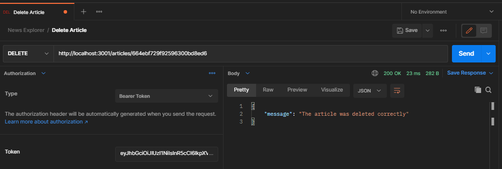

# News Explorer Api

### Description

The news explorer api serves the application of the same name with features like signin, signinup and the possibility to save news if you would like to.

### Technology

This api was build using the following technologies:

- `Node.js`: We are currently using `JavaScript` for development, so in order to leverage this knowledge, the project was build using `Node.js`.
- `express.js`: As we are using `Node.js` we are leveraging `express.js` framework to simplify api development, in order to handle requests.
- `mongodb`: Application data is generated and retrieved using a non-relational database.
- `mongoose`: For the integration with `mongodb` we are leveraging `mongoose` ODM.

### How to install

To install this application, you can simply use `npm install`, this will retreive all the needed dependencies.

### How to run

- `npm run dev`: This will launch the api in dev mode, which will be using `nodemon` in order to debug and "hot reload" the api.
- `npm run start`: This will start the api in production mode.

### How it works

You will find 4 main endpoints:

- `/signin`: Allows a user to login.
- `/signup`: Allows a user to register in the application.
- `/users`: For all resources related to users.
- `/articles`: For all resources related to articles (news).

### /signin

- POST /signin: Will generate a token for the user with the correct credentials.

###### `POST /signin`

##### body

- email (required): email used during signup.
- password (required): password of the user.

##### response

- If the login is correct, you will receive a jwt token, to be used for `/users` and `/articles` endpoints.

  

- If the credentials are incorrect, you will get a `401` status with a message.

  

### /signup

##### body

- email (required): email that the user will use for login.
- password (required): password that the user will use for login.
- username (required): username to display in the application.

  

- If one of the mandatory fields is missing you will get a `400` status and an error message.

  

- If the user already exist, you will get a `409` status and an error message.

  

### /users

#### Resources

- GET /users/me : Will retrieve information for the current user.

### Security

- This endpoint will need a valid jwt token, which can be retrieved from the `/signin` endpoint. You will need to add it to the `Authorization` header and the prefix `Bearer`, e.g. `Bearer 123123123`.

###### `GET /users/me`

---

### /articles

#### Endpoints

- GET /articles: Will retrieve all stored articles.
- POST /articles: Creates a new article with the body of the request.
- DELETE /articles/${articleId} : Deletes the article by its `articleid`.

### Security

- This endpoints will need a valid jwt token, which can be retrieved from the `/signin` endpoint. You will need to add it to the `Authorization` header and the prefix `Bearer`, e.g. `Bearer 123123123`.

###### `GET /articles`

###### `POST /articles`

- The properties `photo` and `url` need to have a valid url format or it will respond `400` status message.
  

###### `DELETE /articles/${articleId}`

###### `Non existent routes`

- For any route that is not configured, you will get a `404` status with a message.

  

- `Any other error`

  - For any other error you will get a `500` status with a generic message.

  
